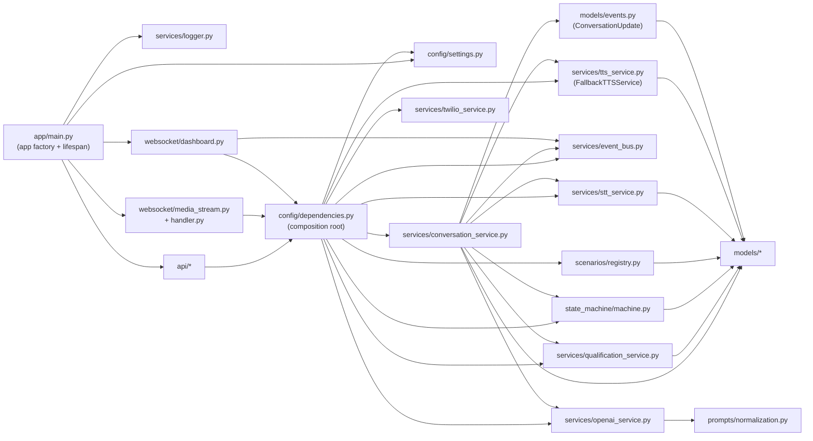
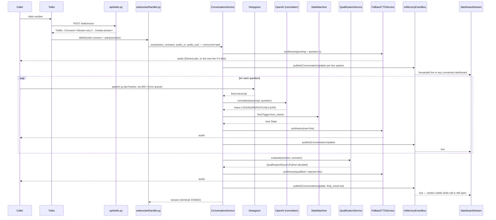
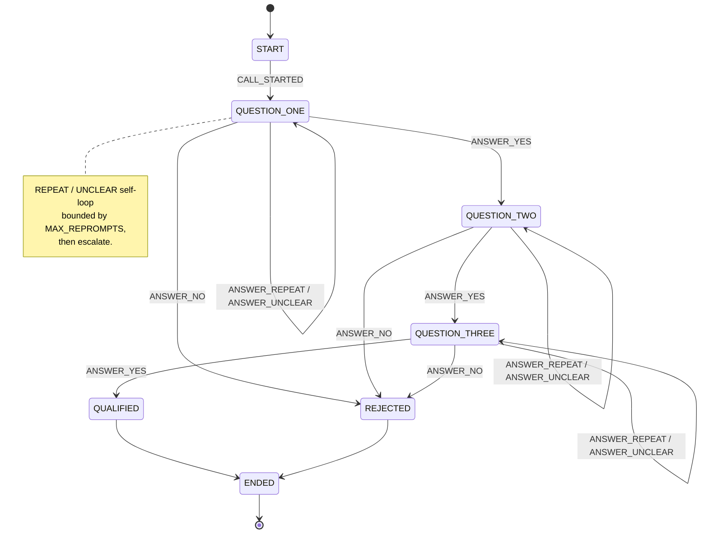

# Architecture

> Voice Qualification Bot — a config-driven, low-latency voice engine that
> screens inbound callers through a fixed set of yes/no gates and returns a
> deterministic verdict. One engine runs many bots (Lead Qualifier, Loan
> Eligibility, …) as data-only **scenarios**.

This document describes the architecture and contracts. **Every piece
described below is fully implemented and has been verified against a real,
answered Twilio phone call** — not just unit-tested in isolation. §9 lists
what's genuinely still open.

---

## 1. Design principles

| Principle | How it shows up here |
|---|---|
| **Clean / Hexagonal architecture** | Domain core (`models`, `state_machine`, `qualification_service`) knows nothing about FastAPI, Twilio, or OpenAI. Vendors sit at the edge as *adapters* behind *ports*. |
| **Dependency inversion** | Orchestration depends on ABCs (`SpeechToTextService`, `TextToSpeechService`, `IntentNormalizer`, `TelephonyService`, `EventPublisher`), never concretes. Binding happens in one place: `app/config/dependencies.py`. |
| **Determinism over LLM** | The LLM only maps speech → `YES / NO / REPEAT / UNCLEAR`. **Python owns every business decision.** |
| **Explicit state machine** | Dialogue control is a declarative transition table, not nested `if`s. |
| **Single Responsibility** | STT, TTS, LLM, telephony, decisioning, observability, and orchestration are separate modules with one reason to change each. |
| **Config over code** | A new client bot is a new `Scenario` object, not a new code path. |
| **Resilience over single points of failure** | TTS is a priority-ordered vendor fallback chain, not one vendor; a billing lapse or outage on one tier falls through to the next rather than the call going silent. |
| **Observation never touches control flow** | The dashboard event bus is a pure side-tap on already-decided state — it cannot influence the call, and the call cannot be affected by it (publish failures are swallowed). |
| **Fail fast & typed** | `pydantic-settings` validates config at startup; type hints + `mypy --strict` everywhere. |

---

## 2. Layers & dependency rule

Dependencies point **inward only**. Nothing in an inner ring imports an outer ring.

```mermaid
flowchart TD
    subgraph Edge["Edge / Delivery (outermost)"]
        API["api/ (HTTP webhooks)"]
        WS["websocket/media_stream.py"]
        DASH["websocket/dashboard.py<br/>(/dashboard/stream)"]
        FE["frontend/ (React dashboard)"]
    end
    subgraph App["Application / Orchestration"]
        CONV["ConversationService"]
        DI["config/dependencies (composition root)"]
    end
    subgraph Ports["Ports (interfaces)"]
        STT["SpeechToTextService"]
        TTS["TextToSpeechService"]
        NORM["IntentNormalizer"]
        TEL["TelephonyService"]
        EVT["EventPublisher"]
    end
    subgraph Adapters["Adapters (vendors)"]
        DG["DeepgramSTTService"]
        FB["FallbackTTSService<br/>(ElevenLabs&#8594;Cartesia&#8594;OpenAI&#8594;System)"]
        OAI["OpenAIIntentNormalizer"]
        TW["TwilioService"]
        BUS["InMemoryEventBus"]
    end
    subgraph Core["Domain core (innermost)"]
        SM["ConversationStateMachine"]
        QUAL["QualificationService"]
        MODELS["models/ (Intent, Scenario, CallSession,<br/>ConversationUpdate, …)"]
    end

    API --> CONV
    WS --> CONV
    DASH --> BUS
    FE -. WebSocket .-> DASH
    DI --> CONV
    DI --> Adapters
    CONV --> Ports
    CONV --> SM
    CONV --> QUAL
    Adapters -.implements.-> Ports
    Ports --> MODELS
    SM --> MODELS
    QUAL --> MODELS
```



**The rule in one line:** `models` imports nothing internal; adapters may import
ports + models; orchestration imports ports + core; the edge imports
orchestration; only the composition root (`dependencies.py`) imports concrete
adapters. The dashboard's WebSocket (`websocket/dashboard.py`) is a second,
independent edge consumer of the same `InMemoryEventBus` singleton that
`ConversationService` publishes to — it never talks to `ConversationService`
directly.

---

## 3. Module dependency graph



No cycles. `models` is a leaf; `state_machine/states.py` is a leaf beneath it
(so `models/session.py` can hold a `State` without an import cycle).
`services/event_bus.py` is transport-only and generic (`EventPublisher[T]`,
`InMemoryEventBus[T]`) — it imports nothing domain-specific, not even
`models/events.py`; only `conversation_service.py` and `dashboard.py` know the
bus carries `ConversationUpdate`.

---

## 4. Call sequence (real, verified behaviour)



The `TTS` participant above is `FallbackTTSService`: it tries ElevenLabs
first, then Cartesia (only if configured), then OpenAI TTS, then — in
`local` development only — the machine's own OS voice. A tier that raises or
produces no audio is logged (`tts.provider_failed`) and the next tier is
tried; once a tier starts producing audio for a line, that's what speaks the
rest of it (never spliced mid-utterance). This was proven under a **real**
vendor failure: ElevenLabs returned `402 Payment Required` on live calls, and
OpenAI TTS spoke every line instead, automatically.

`Bus`/`Dash` are a pure side-tap: `ConversationService` never blocks on or
depends on anything downstream of `publish()` — a full subscriber queue drops
its oldest event rather than back-pressuring the call, and a publish failure
is caught and logged, never propagated.

---

## 5. Conversation state machine

Seven states, an explicit transition table, no nested conditionals.



> `HANGUP` from any non-terminal state → `ENDED` (omitted from the diagram for
> clarity). `QUALIFIED` vs `REJECTED` is control flow only — the *authoritative*
> verdict is produced by `QualificationService.evaluate()`, not by the state.
> Every `ConversationUpdate` snapshot carries the current state, so the
> dashboard's state diagram highlights this same node live.

---

## 6. Folder structure

```
voice-bot/
├── app/
│   ├── main.py                      # FastAPI factory + lifespan  [wired]
│   ├── api/                         # HTTP delivery
│   │   ├── health.py                #   GET /health               [done]
│   │   ├── twilio.py                #   POST /twilio/voice        [done]
│   │   └── conversation_testing.py  #   POST /conversation/test/* [done]
│   ├── websocket/
│   │   ├── media_stream.py          # wss /media-stream route     [done]
│   │   ├── handler.py               # audio bridge: WS <-> ConversationService.run() [done]
│   │   ├── dashboard.py             # wss /dashboard/stream route [done]
│   │   └── protocol.py              # Twilio wire frames          [done]
│   ├── state_machine/
│   │   ├── states.py                # State enum                  [done]
│   │   ├── events.py                # Trigger enum + intent map   [done]
│   │   ├── transitions.py           # guarded Transition + table  [done]
│   │   ├── policies.py              # TransitionPolicy (OCP seam) [done]
│   │   └── machine.py               # table-driven FSM            [done]
│   ├── services/
│   │   ├── stt_service.py           # port + Deepgram adapter     [done]
│   │   ├── tts_service.py           # port + ElevenLabs/Cartesia/OpenAI/System adapters + FallbackTTSService [done]
│   │   ├── openai_service.py        # port + OpenAI normaliser    [done]
│   │   ├── twilio_service.py        # port + Twilio adapter       [done]
│   │   ├── event_bus.py             # transport-only pub/sub (EventPublisher, InMemoryEventBus) [done]
│   │   ├── conversation_service.py  # orchestrator (audio + test + snapshot publishing) [done]
│   │   ├── conversation_store.py    # in-memory store for test-mode sessions [done]
│   │   ├── qualification_service.py # pure decision authority     [done]
│   │   └── logger.py                # structlog setup             [wired]
│   ├── models/                      # Intent, Scenario, CallSession, …  [done]
│   │   └── events.py                # ConversationUpdate — the dashboard snapshot [done]
│   ├── scenarios/
│   │   ├── loader.py                # YAML -> Scenario parser     [done]
│   │   ├── registry.py              # scans data/*.yaml at boot   [done]
│   │   ├── definitions.py           # re-exports LEAD/LOAN consts [done]
│   │   └── data/
│   │       ├── lead_qualifier.yaml  # Home Renovation Lead Qualifier
│   │       └── loan_qualifier.yaml  # QuickRupee Loan Qualification Bot
│   ├── prompts/normalization.py     # LLM system prompt           [done]
│   ├── utils/
│   │   ├── timing.py                # measure()/with_deadline()   [done]
│   │   └── audio.py                 # decode/encode + resample helpers [done]
│   └── config/
│       ├── settings.py              # pydantic-settings           [wired]
│       └── dependencies.py          # DI composition root         [wired]
├── frontend/                        # React dashboard — Live phone-call view + test console
│   └── src/
│       ├── hooks/useLiveCallFeed.ts  # subscribes to /dashboard/stream
│       ├── hooks/useConversationEngine.ts  # drives /conversation/test/*
│       └── components/dashboard/     # shared cards driven by either hook
├── tests/
│   ├── unit/                        # state machine, qualification, scenario
│   │                                 # loader, flow reuse, OpenAI normaliser,
│   │                                 # TTS fallback chain + adapters, event bus
│   └── integration/                 # API, WebSocket media-stream, dashboard
│                                     # live-stream, DI wiring — real ASGI app
├── docker/Dockerfile                # multi-stage image           [done, build-verified]
├── docker-compose.yml               # `docker compose up`         [done, run-verified]
├── docs/ARCHITECTURE.md             # this file
├── LICENSE                          # MIT
├── requirements.txt · requirements-dev.txt · pyproject.toml · .env.example · README.md
```

`[done]` fully implemented · `[wired]` infra implemented.

---

## 7. Key architectural decisions (ADRs)

**ADR-1 — One engine, many scenarios.** Both assignments — the Home Renovation
Lead Qualifier (`lead_qualifier`) and the QuickRupee Loan Qualification Bot
(`loan_qualifier`) — are the same shape (three yes/no gates → qualify/reject),
so they're two `Scenario` data records, not two code paths. Every behavioural
piece — `ConversationStateMachine`, `LinearQualificationPolicy`,
`QualificationService` — is literally the same class for both; only
`scenario.qualified_label` (`"HOT_LEAD"` vs `"ELIGIBLE"`) and the question/script
text differ, both of which are scenario *data*. `tests/unit/test_flow_reuse.py`
parametrizes a single test body over both scenarios as a direct proof there's
no per-scenario branching anywhere in the engine.

**ADR-1a — Scenarios are YAML, not Python.** Scenario content lives in
`app/scenarios/data/*.yaml`, parsed by `app/scenarios/loader.py` into the same
`Scenario` model ADR-1 describes. `ScenarioRegistry` scans that directory at
construction time and loads whatever it finds — adding a third bot is
authoring a third YAML file, with *no* Python change anywhere, not even a new
import. `scenarios/definitions.py` re-exports `LEAD_SCENARIO`/`LOAN_SCENARIO`
as loaded constants purely so existing call sites and tests can still name a
specific scenario directly; the registry does not depend on that module.
Malformed YAML raises `ScenarioDefinitionError` with the offending file and
field named, rather than failing confusingly downstream.

**ADR-2 — LLM is a classifier, not a decider.** The normaliser (`OpenAIIntentNormalizer`)
returns a closed enum via JSON mode + `temperature=0`, and Python validates the
label against `Intent` regardless — any unrecognised, empty, slow, or errored
response collapses to `UNCLEAR`. A misbehaving model literally cannot influence
qualification: all eligibility logic lives in `QualificationService`, in pure
Python — deterministic, unit-testable, and auditable for a fintech context.

**ADR-3 — Ports & adapters for every vendor.** STT/TTS/LLM/telephony are ABCs.
STT is Deepgram; swapping it is a one-line change in the composition root, and
tests inject fakes and never touch a network. The STT adapter requests
μ-law/8kHz output directly from Deepgram, so Twilio's wire format needs no
transcoding on the way in.

**ADR-4 — Explicit FSM over ad-hoc branching.** A declarative
`(State, Trigger) → State` table makes every legal move inspectable and every
transition a unit test. Reprompt limits are first-class guards. **Open/Closed:**
a `TransitionPolicy` compiles a `Scenario` into the table, so a new *standard*
flow is a data object (zero code change) and a new *control semantics* is a new
policy class — `ConversationStateMachine` and existing policies are never edited.

**ADR-5 — WebSockets, not REST, for audio.** Real-time full-duplex voice needs
streaming; the media path is a `wss://` endpoint with per-call async tasks, not
request/response. `websocket/handler.py` bridges Twilio's push-based frame
protocol onto the pull-based `AsyncIterator[AudioChunk]`/callback shape
`ConversationService.run()` expects via an `asyncio.Queue`, running `run()` as
a concurrent task alongside the frame-pump loop so inbound frames keep flowing
while the engine is mid-turn.

**ADR-6 — Streaming end-to-end for latency.** STT interim results, LLM with a
tight timeout, and chunked TTS keep the turn under the sub-second budget (§8).

**ADR-7 — Composition root is the only place concretes are named.** Everything
else programs to interfaces, which is what makes the system testable and swappable.

**ADR-8 — TTS is a priority-ordered fallback chain, not one vendor.**
`FallbackTTSService` wraps ElevenLabs → Cartesia → OpenAI TTS → (dev-only) a
local OS voice, all behind the same `TextToSpeechService` port
`ConversationService` already depended on — **zero changes to
`ConversationService`** were needed to add this. Each tier now *raises* on
failure (rather than silently swallowing it, the pre-fallback-chain behaviour)
so the chain can detect and log it (`tts.provider_failed`, flagging whether it
looked like a billing/auth error via a vendor-agnostic `.status_code` duck-type
check) and try the next tier; once a tier has started producing audio for a
line it is never abandoned mid-utterance for another tier (that would splice
two different voices together). Cartesia only enters the chain once both an
API key and a voice id are configured — Cartesia voice ids are account-specific,
so there is no safe default to guess. The local OS voice (`pyttsx3`) is
strictly `environment=="local"`-gated and is a dev-only dependency
(`requirements-dev.txt`, never in the production image); its import is
guarded so a production process that never installed it still boots fine.

**ADR-9 — Live observability is a side-tap, never a dependency of the call.**
`ConversationService.run()` publishes one canonical, immutable
`ConversationUpdate` snapshot (state, qualification progress, latency, final
result, running transcript) after every meaningful turn, to an injected
`EventPublisher[ConversationUpdate]`. The default is a `NullEventPublisher` — a
no-op — so every pre-existing caller and test of `ConversationService`
continues to work completely unchanged. The real implementation,
`InMemoryEventBus`, is deliberately generic and transport-only: it is
`Generic[T]` and imports nothing from the domain (not Twilio, not Deepgram, not
the state machine, not even `models/events.py`) — it just fans an opaque event
out to subscribers, non-blocking (`put_nowait`, drop-oldest on a full queue)
and never-raising (a publish failure is caught and logged inside
`ConversationService`, never propagated). `websocket/dashboard.py` subscribes
and forwards snapshots as JSON to any connected dashboard. One canonical event
type — not a family of them — was a deliberate simplification: a client always
renders from the *latest* snapshot rather than dispatching on event type, and
a client that connects mid-call catches up from the bus's replay buffer alone.

---

## 8. Latency budget (target: < 1 s turn, < 800 ms core)

| Stage | Technique | Target |
|---|---|---|
| Speech endpointing (STT final) | Deepgram streaming + endpointing | ~150–250 ms |
| Intent normalisation (LLM) | small model, JSON mode, hard timeout, minimal prompt | ~150–300 ms |
| Decision (Python) | in-memory, O(gates) | < 1 ms |
| TTS first audio byte | ElevenLabs Flash v2.5, streamed, μ-law/8kHz (no transcode) | ~75–150 ms |
| Orchestration overhead | asyncio, non-blocking I/O, no thread hops | < 50 ms |

Cross-cutting: barge-in (stop TTS the instant the caller speaks) and connection
reuse are still future work. Per-turn STT/LLM/TTS/total timing **is** emitted to
structured logs today via `measure()` (`utils/timing.py`), tagged with
`conversation_id`/`call_sid` — see `ConversationService._log_context` — and the
same numbers ride along on every `ConversationUpdate` snapshot to the dashboard.

The latency budget above describes the primary (ElevenLabs) tier. Falling
back to Cartesia or OpenAI TTS costs an extra failed-request round-trip on
that turn only (observed ~100–700ms for the failed ElevenLabs call in
practice) before the next tier's own synthesis latency; the local OS voice
(dev-only) has no network cost but is not latency-budgeted since it never
runs outside local development.

---

## 9. What is genuinely still open

Everything described in §1–§8 is implemented and has been verified against a
real, answered Twilio phone call, including the TTS fallback engaging under a
genuine vendor billing failure and the dashboard rendering a call live. What's
left is real polish, not missing architecture:

- **OpenAI cold-start latency**: the intent classifier's timeout budget
  (`OPENAI_TIMEOUT_SECONDS`, default 3.0s) has been observed to be too tight
  on the very first classification of a freshly-started process, degrading
  that one turn to `UNCLEAR` → a reprompt (working exactly as designed, just
  suboptimal UX on a cold process) — worth either a longer first-call budget
  or a startup pre-warm request.
- **Agent transfer is not gated per-scenario.** Any qualified outcome
  transfers if `AGENT_TRANSFER_NUMBER` + Twilio credentials are configured,
  regardless of scenario; a `Scenario.requires_agent_transfer` flag would be
  the right fix (flagged since the orchestration phase, still not done).
- **STT and the LLM classifier are still single-vendor.** Only TTS has the
  fallback-chain treatment (ADR-8); the same pattern could extend to Deepgram
  and OpenAI if resilience there becomes a priority.
- **Persistence is in-memory and per-process.** Both
  `InMemoryConversationStore` (test-mode sessions) and `InMemoryEventBus`'s
  replay buffer (dashboard reconnects) are process-local — a restart or a
  second process loses that state. Fine for this deployment's scale; a real
  multi-instance production deployment would need a shared store/bus.
- **Dashboard shows one call at a time.** The Live view renders the
  current/most-recent call from the bus's replay buffer; there's no
  per-call history or selection across multiple past calls.
- **Frontend bundle is unsplit** (~875 KB minified) — fine for one page,
  would want route-level code-splitting if the dashboard grows more views.
